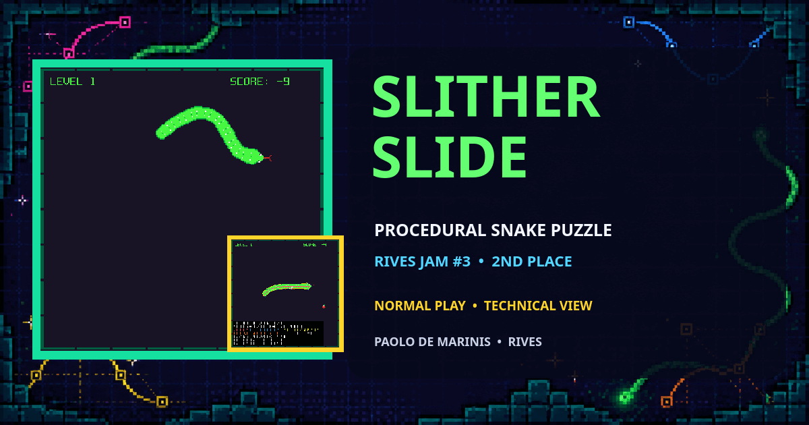
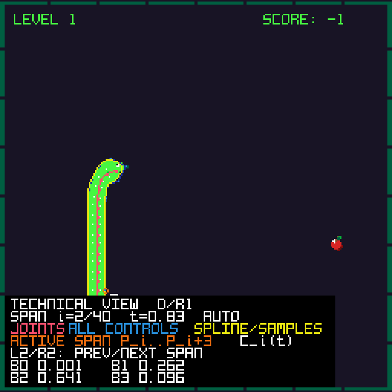
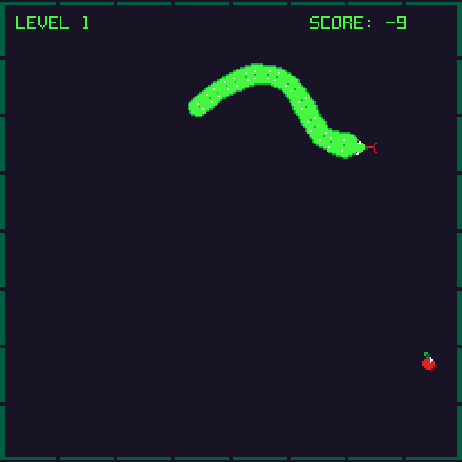

# Slither Slide



Slither Slide is a RIVES cartridge built around a multi-room snake game. The player collects apples and coins, grows a procedurally rendered body, opens level doors and avoids walls and self-collision.

## Original RIVES cartridge and Jam result

Slither Slide placed 2nd out of 7 entries in RIVES Jam #3, whose theme was **Slide**.

- [Play the original Slither Slide cartridge on RIVES](https://app.rives.io/cartridges/7654435bf067)
- [Paolo's RIVES profile](https://app.rives.io/profile/0x2e092f91bc25ebd12b8b0e4df87d9d0424d6460c) — the profile lists the two original cartridges
- [RIVES Jam #3 page](https://itch.io/jam/rives-jam-3)
- [Cartesi 2024 year in review — RIVES Creator Season 1 and RIVES Jam #3](https://cartesi.io/blog/goodbye_2024/)
- [Contemporary RIVES post announcing the seven Jam cartridges](https://x.com/rives_io/status/1867175214037291399)
- [RIVES Jam #3 results: Slither Slide in 2nd place](https://x.com/rives_io/status/1867175218642636978)
- Original publication: 3 December 2024, under the RIVES profile **Paolo**

The Slither Slide itch.io submission was later removed, so the live Jam page now shows the six submissions that remain listed. The contemporary RIVES posts record the original seven-cartridge field and Slither Slide's 2nd-place result.

## About this repository

This repository contains a post-jam, maintained version of the cartridge originally developed for RIVES Jam #3. The exact source snapshot submitted to the jam is no longer retained; the current codebase includes subsequent fixes, cleanup, documentation and refactoring.

Only the maintained source, standalone host-side tests and required build assets are included; working archives and extracted copies of the original cartridge are intentionally excluded.

The current maintained version is developed with assistance from OpenAI Codex.

## Development

Slither Slide was developed in C against the RIV API (`riv.h`) through a Cursor-assisted workflow. Paolo De Marinis conceived the mechanics and gameplay, directly wrote and modified parts of the code, and handled integration, testing and refinement. He selected and mathematically configured the B-spline curves used for the procedural snake profile; the related implementation code was produced with Cursor assistance and personally integrated and validated.

## Technical reading path

The documentation follows the same progression used in a mathematical implementation note:

1. [Mathematical model](docs/b-spline.md) — assumptions, joint constraints, profile construction, cubic basis, exact midpoint sample and design trade-offs.
2. [Code overview](docs/code-overview.md) — state, frame flow, module responsibilities and correspondence between formulas and functions.
3. [Validation](docs/validation.md) — reproducible checks and the boundary between tested behavior and implementation limits.

## Gameplay

Choose the snake or caterpillar skin, then collect the required items in each room. The last item is rendered as a coin; collecting it completes the room and opens the route forward. Collecting the final coin in room 12 completes the cartridge. Returning to the previous adjacent room is allowed; completed rooms keep their result and do not generate another collectible. Contact between the head and a closed boundary, obstacle or the body ends the run.

| Action | Keyboard | RIVES gamepad |
|---|---|---|
| Choose skin | Arrow UP / DOWN | D-pad UP / DOWN |
| Start | Z or E | A1 or START |
| Move | Arrow keys | D-pad |
| Toggle Technical view | D | R1 |
| Previous / next Technical span | A / F | L2 / R2 |

The snake cannot reverse directly into its current direction. The Technical view is available in the normal cartridge, starts disabled and is rendered only for the snake skin. Its span selection advances automatically until A/F or L2/R2 is pressed, then remains under manual control.

## Technical overview

`main()` in `src/main.c` initializes RIVES, audio, `GameData` and the separate developer-control state, then calls `gameUpdate()`, `gameDraw()` and `playBackgroundMusic()` once per `riv_present()` frame. Logical movement uses a tile grid; `JointPoint` values follow the head to produce smooth visual geometry. Levels occupy a 4 × 3 room matrix, with `cameraUpdate()` easing the view between rooms. Head collisions use circle/rectangle and sampled body-segment tests. Rendering converts the two sides of the body into a closed cubic uniform B-spline outline and fills it with triangles.

The implementation is procedural C, not object-oriented code. See [the code overview](docs/code-overview.md) for the complete state and frame flow.

## Code structure

- `src/main.c` — RIVES setup and frame loop.
- `src/game_state.h` — central state and invariants shared by the procedural modules.
- `src/game.c` / `game.h` — lifecycle, frame orchestration and terminal states.
- `src/snake_motion.c` / `snake_motion.h` — input, grid movement, tail motion and collection events.
- `src/collision.c` / `collision.h` — room-edge, wall and self-collision tests.
- `src/body_chain.c` / `body_chain.h` — joint constraints, fixed head anchor and final tangent update.
- `src/snake_geometry.c` / `snake_geometry.h` — pure profile construction, periodic span evaluation and renderer samples.
- `src/scoring.c` / `scoring.h` — per-level clocks, persistent bonuses, total score and outcard.
- `src/game_render.c` / `game_render.h` — HUD, characters, optional Technical view and ending panels.
- `src/snake_char.c` / `snake_char.h` — B-spline fill plus snake head, tongue and scale drawing.
- `src/spline_math.c` / `spline_math.h` — the four cubic uniform B-spline basis weights.
- `src/technical_view.c` / `technical_view.h` — read-only visualization of joints, controls, samples, active span and basis weights.
- `src/developer_controls.c` / `developer_controls.h` — runtime UI toggle and active-span selection, kept outside `GameData`.
- `src/caterpillar_char.c` / `caterpillar_char.h` — alternate character renderer.
- `src/levels.c` / `levels.h` — level requirements, doors, transitions and obstacles.
- `src/room_layout.c` / `room_layout.h` — room matrix and adjacency rules.
- `src/collectible.c` / `collectible.h` — deterministic spawn, collection state and short physics response.
- `src/collectible_render.c` / `collectible_render.h` — apple and coin primitive rendering.
- `src/walls.c` / `walls.h` — wall storage, geometric contact queries and drawing.
- `src/camera.c` / `camera.h` — world-to-screen conversion and room transition smoothing.
- `src/char_selector.c` / `char_selector.h` — initial skin menu.
- `src/audio.c` / `audio.h` and `src/seqt.h` — music and sound effects.
- `tests/` — layout, all door transitions, scoring, final completion, spawn failure, body-chain and B-spline checks.

## Technical view



The normal-build overlay follows the live snake geometry. Pink marks the center-chain joints; every lateral control point remains light blue and the closed control polygon is blue; yellow marks the curve and renderer samples. Four orange rings identify only the controls $P_i,\ldots,P_{i+3}$ that contribute to the selected span, not the complete control-point set. White marks the animated $C_i(t)$. The panel reports the selection mode, $t$ and the four basis weights.

| Normal gameplay | Technical view |
|---|---|
|  |  |

## Procedural body mathematics

`snakeGeometryBuild()` creates an ordered closed outline from left and right offsets around the body joints. `snakeGeometryEvaluateSpan()` obtains the four degree-3 uniform B-spline weights from `cubicUniformBSplineBasis()` and the geometry module stores the renderer's two samples per span, at `t = 0.0` and `0.5`. `drawSnakeBody()` consumes those samples for the paired-triangle fill and closed edge. This spline is visual geometry; gameplay collision tests use the joint chain and a single skin-independent head radius that preserves the original gameplay clearance. See [the mathematics of the procedural body](docs/b-spline.md), including the joint constraints, profile construction, cubic basis, design trade-offs and study-source attribution.

The visible construction is

```math
\text{dynamic joints}\longrightarrow\text{lateral profile}
\longrightarrow\text{control polygon}\longrightarrow\text{B-spline}
\longrightarrow\text{triangulation}.
```

## Technical view, diagnostics and cheats

Press D/R1 to toggle the Technical view at runtime. It distinguishes the center-chain joints, all lateral B-spline control points, the control polygon, the sampled spline and the four controls of one active span. The span advances automatically until the first A/F or L2/R2 press. Afterwards each press selects exactly the previous or next span, from $P_i,\ldots,P_{i+3}$ to $P_{i\pm1},\ldots,P_{i\pm1+3}$, with wrap-around modulo the current control-point count. A moving white point continues to display $C_i(t)$ for $t\in[0,1)$ inside the selected span; the panel reports the current span and the four basis weights $B_0(t),\ldots,B_3(t)$. The two samples actually consumed by the renderer, $t=0$ and $t=0.5$, are drawn explicitly. The view reads the same `SnakeGeometry` used by the renderer and has no access to movement, timers, score, RNG, collision rules or outcard state.

`DEBUG_MODE` and `CHEATS_ENABLED` default independently to `0` in `src/game_state.h`. `DEBUG_MODE=1` enables collision, lifecycle and audio diagnostics without changing available controls. `CHEATS_ENABLED=1` separately enables R/R3 level advancement through the ordinary scoring and door path; on level 12 it completes the run. The normal-build Technical view is independent of both flags.

## Technical documentation

- [Code overview](docs/code-overview.md)
- [Mathematics of the procedural body and B-spline](docs/b-spline.md)
- [Validation](docs/validation.md)

## Related RIVES cartridge

- [Bomb Flip source repository](https://github.com/paolo-de-marinis/bomb-flip)
- [Play the original Bomb Flip cartridge on RIVES](https://app.rives.io/cartridges/5932d82f5827)

## Prerequisites: RIVEMU and the RIV SDK

This cartridge uses the official [RIV framework and RIVEMU repository](https://github.com/rives-io/riv). RIVEMU is sufficient to run an already-built cartridge; compiling the C sources also requires the RIV SDK.

For complete and platform-specific instructions, see the official RIVES guides:

- [Installing RIVEMU](https://rives.io/docs/riv/getting-started/)
- [Installing the SDK and developing cartridges](https://rives.io/docs/riv/developing-cartridges/)

The following Linux x86_64 setup matches the default paths used by this repository's Makefile:

```sh
mkdir -p "$HOME/.riv"

wget -O "$HOME/.riv/rivemu" \
  https://github.com/rives-io/riv/releases/latest/download/rivemu-linux-amd64
chmod +x "$HOME/.riv/rivemu"

wget -O "$HOME/.riv/rivos-sdk.ext2" \
  https://github.com/rives-io/riv/releases/latest/download/rivos-sdk.ext2
```

Verify both components:

```sh
"$HOME/.riv/rivemu" -version

RIVEMU_SDK="$HOME/.riv/rivos-sdk.ext2" \
  "$HOME/.riv/rivemu" -quiet -no-window -sdk \
  -exec /usr/lib/libriv.so version
```

The current normal build and captures were verified with RIVEMU and `libriv` 0.3.0 plus RIV OS SDK 0.3.0, including a 96 MB runtime smoke check. See [Validation](docs/validation.md). For another operating system or architecture, download the matching RIVEMU binary from the [official releases](https://github.com/rives-io/riv/releases) and pass its path to `make`.

## Building and running

By default, the Makefile reads RIVEMU and the SDK from `~/.riv`. To use different locations, override `RIVEMU` and `RIVEMU_SDK`:

```sh
make -C src \
  RIVEMU=/path/to/rivemu \
  RIVEMU_SDK=/path/to/rivos-sdk.ext2 \
  clean all
```

With the default installation above:

```sh
make -C src clean all
make -C src run
```

Checks:

```sh
make -C src strict
make -C src test
make -C src smoke
```

`strict` compiles every production module with warning-free C11 analysis in the release, debug-only and cheats-only configurations. `test` builds nine host-side C checks, including the room matrix, all eleven door transitions and backtracking, per-level scoring, body-chain invariants, the cubic basis, constructed spline geometry, Technical-view toggle state, final completion, spawn failure and collision clearance. `smoke` runs the packaged cartridge headlessly for 180 frames.

## Repository history

This repository starts from the reviewed, publication-ready source. The published 2024 RIVES cartridge remains available through the RIVES link above, while local working archives and cleanup history are intentionally not part of this repository. The later cleanup does not establish historical authorship of individual parts of the original cartridge.

## License

No license file was included with the original cartridge source, and this repository does not add one. No permission to copy, modify or redistribute the source is granted beyond rights provided by applicable law.
