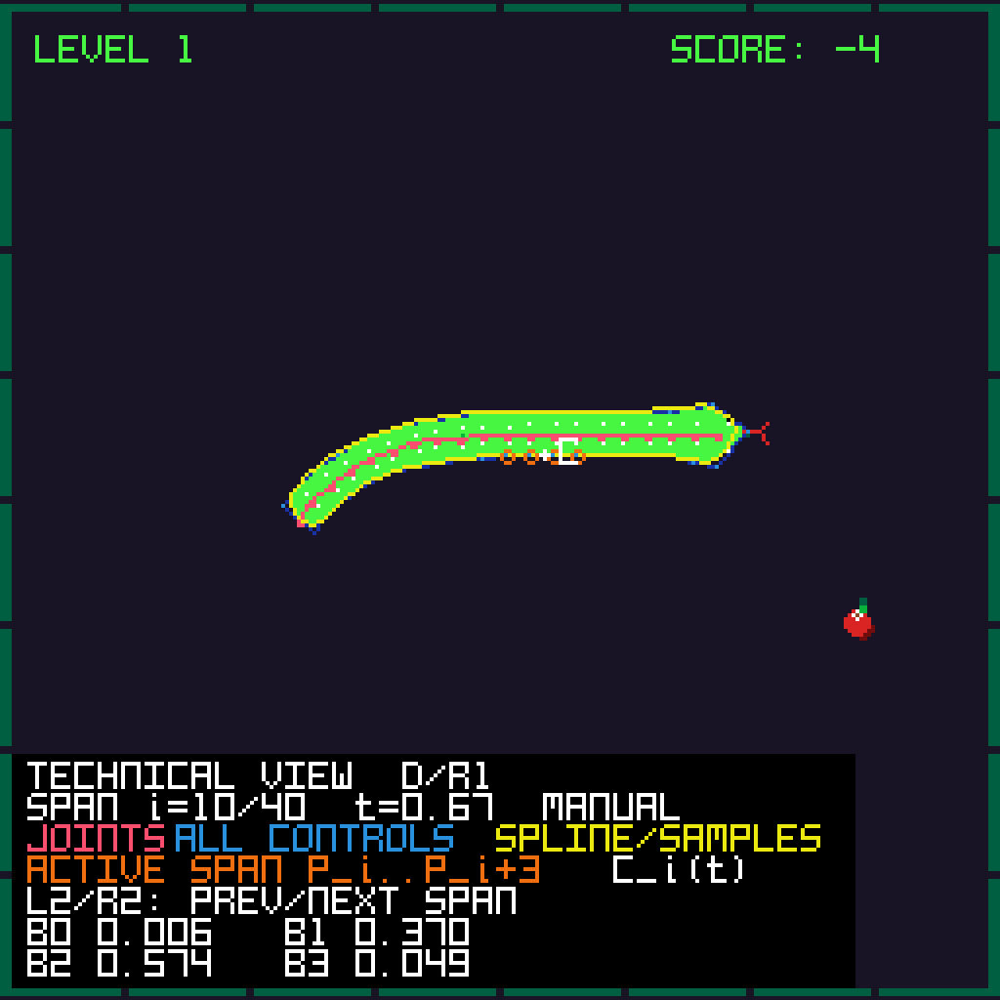

# Mathematics of the procedural body

## Scope

The Slither Slide RIVES cartridge separates gameplay state from visual geometry. The head moves on a tile grid and collisions use simple primitives, while the visible body is generated every frame from a chain of joints and a closed cubic B-spline outline.

This document records the assumptions, notation and mathematical choices present in the maintained implementation. It is an implementation note, not a claim that the cartridge contains a general-purpose physics engine or spline library.

## 1. From a discrete game to a continuous-looking body

Let the ordered joint centers be

```math
J_i=(x_i,y_i), \qquad i=0,\ldots,m-1,
```

where $J_0$ is the head joint. Logical movement changes the grid position first; `bodyChainUpdate()` then applies its geometric corrections. Joint zero is imposed as a boundary condition both before and after that pass, hence

```math
J_0=\left(Tq_x+\frac{T}{2},\;Tq_y+\frac{T}{2}\right)
```

is a final invariant when the logical head occupies grid cell $(q_x,q_y)$. This split was deliberate:

- the grid keeps movement and room rules predictable;
- the joint chain introduces delay, curvature and overlap correction;
- the spline smooths the polygonal outline without changing the logical path.

The result is a continuous-looking character driven by discrete gameplay.

## 2. Joint-chain constraints

For a follower joint $J_i$, define

```math
\Delta_i=J_{i-1}-J_i,\qquad d_i=\|\Delta_i\|.
```

`followPreviousJoint()` in `body_chain.c` uses the tile size $T$ as its principal link length.

For $d_i>\varepsilon$, with $\varepsilon=10^{-4}$ in the implementation, the following two branches apply. When $d_i>T$, the correction is

```math
J_i' = J_i + \frac{d_i-T}{d_i}\Delta_i.
```

This places the follower exactly $T$ units from the previous joint. When the distance is not above $T$, the code applies a half-strength relaxation toward $0.9T$:

```math
J_i' = J_i + \frac{1}{2}\frac{d_i-0.9T}{d_i}\Delta_i.
```

The second rule is intentionally softer. It reduces compression without making every link perfectly rigid on every frame. When $d_i\leq\varepsilon$, no normalized correction is applied, avoiding division by a numerically negligible distance.

After all position corrections, the local direction stored by a follower joint is recomputed as

```math
\theta_i=\mathrm{atan2}(y_{i-1}-y_i,\;x_{i-1}-x_i).
```

For the head, the same orientation is obtained from $J_0-J_1$. Two additional geometric corrections make the chain useful inside the game world:

- non-head joint pairs whose indices differ by at least three are separated when their distance lies in $(\varepsilon,0.8(w_i+w_j))$, with a symmetric half-correction and a decaying propagation toward later joints; coincident or near-coincident pairs are left unchanged because no reliable normal is available;
- a joint inside a wall-clearance radius is pushed away from the closest point of the axis-aligned wall rectangle.

These operations are lightweight position-based constraints. They are not an exact elastic-body simulation; their purpose is stable, readable motion at cartridge scale.

The final tangent reconstruction is deliberately a separate pass. Profile normals therefore correspond to the corrected chain rather than to an intermediate constraint state.

## 3. From the center chain to the outline

For a joint direction $\theta_i$, use the unit tangent and normal

```math
\mathbf t_i=(\cos\theta_i,\sin\theta_i),\qquad
\mathbf n_i=(-\sin\theta_i,\cos\theta_i).
```

With local half-width $w_i$, the two profile points are

```math
L_i=J_i+w_i\mathbf n_i,\qquad
R_i=J_i-w_i\mathbf n_i.
```

This is the vector form of `snakeOffsetPosition()`, which evaluates the same construction using angles $\theta_i+\pi/2$ and $\theta_i-\pi/2$.

`snakeBodyWidth()` makes the profile non-uniform:

- 8 pixels at the head;
- 7 pixels at the next joint;
- then a gradual taper from 6 pixels to a minimum of 4.

`snakeGeometryBuild()` orders the control polygon as one side from tail to head, a forward head point, and the other side from head to tail. For $m$ joints this produces $2m+1$ profile controls. The center joints are therefore not the B-spline control points: the spline acts on the offset outline.

## 4. Uniform cubic B-spline

The renderer uses a uniform cubic B-spline: degree 3 and order 4. On each span, $t\in[0,1)$, four consecutive control points contribute through

```math
\begin{aligned}
b_0(t)&=\frac{(1-t)^3}{6},\\
b_1(t)&=\frac{3t^3-6t^2+4}{6},\\
b_2(t)&=\frac{-3t^3+3t^2+3t+1}{6},\\
b_3(t)&=\frac{t^3}{6}.
\end{aligned}
```

For control points $P_i,\ldots,P_{i+3}$, the curve segment is

```math
C_i(t)=\sum_{k=0}^{3}b_k(t)P_{i+k}.
```

The same weighted sum is evaluated independently for the screen-space $x$ and $y$ coordinates.

This basis was a good fit for the game because:

- $b_k(t)\geq0$ and $\sum_k b_k(t)=1$, so every sample is a convex combination of four nearby control points;
- each span has local support: moving one profile point affects only neighbouring spans;
- consecutive cubic spans join with $C^2$ continuity for the uniform construction;
- the curve approximates the control polygon instead of being forced through every profile point, which softens the joint chain.

The implementation is a parametric planar B-spline. It does not construct a natural interpolating spline by solving a global system for derivatives or moments.

### A sample worked exactly as the renderer uses it

The implementation samples every span at $t=0$ and $t=0.5$. At the midpoint,

```math
b_0\!\left(\frac12\right)=b_3\!\left(\frac12\right)=\frac{1}{48},
\qquad
b_1\!\left(\frac12\right)=b_2\!\left(\frac12\right)=\frac{23}{48}.
```

Therefore the second sample of span $i$ is

```math
C_i\!\left(\frac12\right)
=
\frac{P_i+23P_{i+1}+23P_{i+2}+P_{i+3}}{48}.
```

This makes the smoothing mechanism explicit: the two central profile points dominate the sample, while the two outer points make a smaller symmetric contribution. No global linear system is solved and changing a control point has only local influence.

The basis also preserves affine geometry because

```math
b_0(t)+b_1(t)+b_2(t)+b_3(t)=1.
```

Translations, rotations and uniform scalings of the control polygon are therefore reproduced by the curve. Continuity can be checked directly at a span boundary:

```math
\begin{aligned}
C_i'(1)&=\frac{-P_{i+1}+P_{i+3}}{2}=C_{i+1}'(0),\\
C_i''(1)&=P_{i+1}-2P_{i+2}+P_{i+3}=C_{i+1}''(0).
\end{aligned}
```

Thus the underlying piecewise-cubic curve is $C^2$ across ordinary uniform spans. The rasterized outline remains an approximation of that curve because the cartridge deliberately uses only two samples per span.

## 5. Periodic closure and sampling

The outline is closed by taking the four control indices for each span modulo the control-point count. This is algebraically equivalent to appending the first three controls, but avoids maintaining a second extended array. The last spans therefore reuse the ordinary four-point formula and meet the beginning of the curve without a separate endpoint branch.

Each span is sampled at

```math
t=0,\;0.5.
```

The endpoint $t=1$ is omitted because it is the start of the next span. Two samples per span were a performance/appearance choice: increasing the sampling density would reduce visible faceting on tight turns, but would also increase the number of drawing operations.

## 6. From samples to pixels

The sample array produced by `snakeGeometryBuild()` follows the two sides of the closed body. `drawSmoothCurve()` consumes that array, pairs samples from opposite sides and fills each adjacent pair with two triangles. A second pass draws the closed edge.

This is a rasterization choice, not an additional spline operation. The head, tongue and scale decorations are drawn separately.

Gameplay collision intentionally uses a cheaper approximation:

- head circle against room boundaries and wall rectangles;
- five samples, including both endpoints, along each relevant centerline segment for self-collision.

The collision code does not test the rendered B-spline triangles. Consequently, the visible surface and the collision surface are close but not identical.

## 7. Runtime Technical view

D/R1 toggles a normal-build Technical view without restarting the cartridge. The renderer and the view consume the same `SnakeGeometry` object; the visualization does not reconstruct the curve independently. Its layers make the complete pipeline inspectable:


```math
\text{dynamic joints}\longrightarrow\text{lateral profile}
\longrightarrow\text{control polygon}\longrightarrow\text{B-spline}
\longrightarrow\text{triangulation}.
```

The colors distinguish center joints, lateral controls, the control polygon and the sampled curve. Every control point in the complete closed polygon remains light blue. The four orange rings are a second, local annotation: they identify only the four controls $P_i,\ldots,P_{i+3}$ that contribute to the selected span and do not represent the full control-point set. All actual renderer samples at $t=0$ and $t=0.5$ are marked. A white point evaluates

```math
C_i(t)=\sum_{k=0}^{3}b_k(t)P_{i+k}
```

for a frame-derived $t\in[0,1)$. A panel labels the light-blue set as `ALL CONTROLS`, the orange subset as `ACTIVE SPAN P_i..P_i+3`, and reports the span, $t$ and the four current weights. This animated point is an explanatory evaluation of the same basis, whereas the yellow points are the fixed samples used for triangulation.



The yellow renderer samples remain fixed at $t=0$ and $t=0.5$ within every span. The white $C_i(t)$ point is separate: it moves continuously through the selected span for explanation and is not an additional triangulation sample.

Selection is automatic until the first A/F or L2/R2 press. L2 selects span $i-1$ and R2 selects span $i+1$, so one press moves the four-control window by one control point rather than four. Both directions wrap modulo `controlPointCount`. Manual selection is normalized against the live count on every lookup and navigation event, including after growth changes the number of controls; $C_i(t)$ keeps animating inside the selected span.

The toggle and manual span index belong to a small app-level `DeveloperControls` structure rather than `GameData`. `technicalViewDraw()` receives only read-only joints, the shared geometry, the selected span and its display parameter. It cannot update movement, level clocks, score, RNG, collision state, audio or the JSON outcard. The view is shown only for the snake skin; the caterpillar renderer is not presented as a B-spline construction.

## 8. Design choices and trade-offs

| Choice in Slither Slide | Mathematical effect | Practical reason / trade-off |
|---|---|---|
| Grid-driven head plus floating-point joints | Separates discrete state from smoothed geometry | Predictable controls with organic motion |
| Link target $T$, soft compression target $0.9T$ | Limits extension while relaxing compression | Stable following without a completely rigid chain |
| Normal offsets $J_i\pm w_i\mathbf n_i$ | Converts a centerline into a two-sided profile | Body shape follows local orientation |
| Tapered $w_i$ | Varies the profile envelope along the chain | Recognisable head and narrowing tail |
| Uniform cubic B-spline | Local, $C^2$-smooth approximation | Smooth profile with a small fixed basis |
| Control indices taken modulo $2m+1$ | Periodic four-point evaluation | Closed body without endpoint special cases |
| Two samples per span | Piecewise-linear raster approximation | Bounded drawing cost |
| Simpler collision primitives | Approximate rather than exact surface collision | Keeps gameplay tests independent of rendering density |

## 9. Mathematical authorship and implementation boundary

Paolo De Marinis selected the B-spline family and mathematically configured how it is used for the snake profile: the control-point construction, closure, degree/basis and sampling choice were integrated into the game and personally validated. The related implementation code was produced with Cursor assistance within the broader Cursor-assisted development workflow.

The maintained repository makes those choices inspectable in `src/spline_math.c`, `src/snake_geometry.c` and `src/snake_char.c`, and shows how they interact with the joint constraints in `src/body_chain.c`.

## 10. Study sources and attribution

### Mathematical background

The following University of Pisa notes by Dario Andrea Bini support the mathematical terminology and derivation used in this documentation:

- [Teaching-notes index](https://people.dm.unipi.it/bini/Didattica/IAN/appunti/appunti.html)
- [Interpolazione polinomiale a tratti](https://people.dm.unipi.it/bini/Didattica/IAN/appunti/splinenuovo.pdf) — piecewise cubic splines, continuity and boundary conditions
- [Traccia della terza parte del corso di IAN](https://people.dm.unipi.it/bini/Didattica/IAN/appunti/terzaparte.pdf) — compactly supported cubic B-spline basis

Bini's interpolating-spline construction is broader background rather than the exact algorithm used here. Slither Slide directly evaluates a uniform parametric B-spline over a closed 2D control polygon.

### Original procedural-animation study source

- [Programming Procedural Animations](https://www.youtube.com/watch?v=wFqSKHLb0lo), Programming Chaos — conceptual study of joint-chain procedural animation.

This video was the procedural-animation source studied during the original development.

### Retrospective comparison source

- [animal-proc-anim](https://github.com/argonautcode/animal-proc-anim), © 2024 argonaut, [MIT License](https://github.com/argonautcode/animal-proc-anim/blob/main/LICENSE) — an open-source 2D chain-animation implementation used as a retrospective comparison source.

The comparison source and Slither Slide share a recognisable high-level structure: a linked center chain, angle-based offsets at $\pm\pi/2$, a tapered width and traversal of both sides to form a closed body. This comparison is not evidence that the repository was used during the original cartridge development, and no code-lineage claim is made from the similarity alone.

The maintained Slither Slide implementation is C code for RIVES and contains a grid-driven head, its own link relaxation, non-neighbour and wall corrections, an explicitly evaluated uniform cubic B-spline, paired-triangle filling, fixed-capacity buffers and cartridge-specific collision approximations. The comparison source remains under its own MIT license; citing it does not license this repository.

## 11. Relevant code

- `JointPoint` in `src/joint_point.h` — center position and local angle.
- `bodyChainUpdate()`, `followPreviousJoint()`, `resolveJointOverlap()` and `pushJointFromWalls()` in `src/body_chain.c` — evolving center chain and final tangent reconstruction.
- `snakeBodyWidth()` — width profile.
- `snakeOffsetPosition()` — center-to-outline transformation.
- `snakeGeometryBuild()` — closed control polygon and the two renderer samples per span.
- `snakeGeometryEvaluateSpan()` — periodic four-control evaluation at arbitrary $t\in[0,1]$.
- `drawSnakeBody()` — consumption and rasterization of the shared geometry.
- `cubicUniformBSplineBasis()` in `src/spline_math.c` — the four cubic uniform basis weights.
- `drawSmoothCurve()` — paired-triangle fill and sampled outline.
- `technicalViewDraw()` — read-only display of the pipeline, active span and weights.

## 12. Implementation limits

- Sampling is fixed at two points per span.
- Control and sample coordinates are converted to integers before rasterization.
- Triangle pairing depends on the two outline sides having matching order and sample counts.
- Buffers are statically sized from `MAX_JOINTS`.
- Collision geometry approximates rather than exactly reproduces the rendered spline surface.

The host-side mathematical checks verify non-negativity and partition of unity of the four basis weights at 101 points in $[0,1]$, their endpoint and exact midpoint values, geometry output counts, periodic closure at every span, agreement between stored samples and direct evaluation, the final head anchor and the tangent formula for every joint in a controlled chain. A separate toggle-state test verifies disabled initialization and press-edge switching. These are implementation invariants; they do not amount to a proof of stability for every possible joint configuration.
